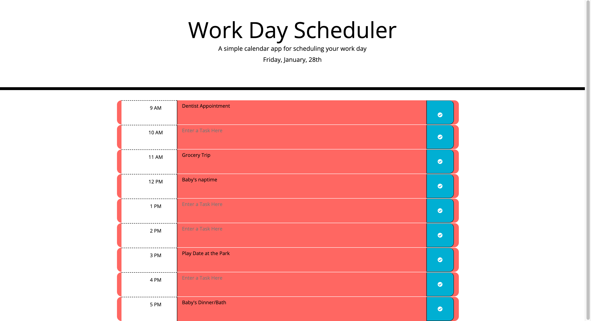

# Work Day Scheduler

## Description 📖 
This is a simple calendar application that allows users to save events for each hour of the work day.

## Built With
* HTML
* CSS
* JavaScript
* jQuery
* Moment.js

## Links 🔗 
* [Deployed](https://marisolramirez1031.github.io/workday-scheduler/) Application

## License
 This project is covered by the [MIT](https://choosealicense.com/) license.

## Credits 🏆
* [moment.js](https://cdnjs.com/libraries/moment.js)
* Starter code provided by the UT [Bootcamp](https://github.com/coding-boot-camp/super-disco)

## Visual 👀

